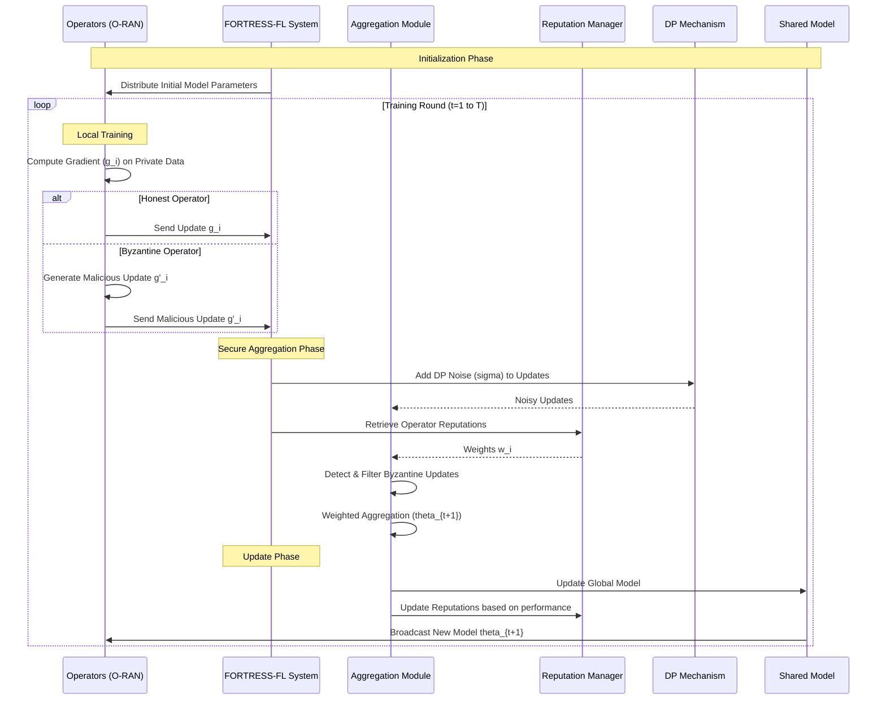

```mermaid
sequenceDiagram
    participant O as Operators (O-RAN)
    participant F as FORTRESS-FL System
    participant A as Aggregation Module
    participant R as Reputation Manager
    participant D as DP Mechanism
    participant S as Shared Model

    Note over O, S: Initialization Phase
    F->>O: Distribute Initial Model Parameters
    
    loop Training Round (t=1 to T)
        Note over O: Local Training
        O->>O: Compute Gradient (g_i) on Private Data
        
        alt Honest Operator
            O->>F: Send Update g_i
        else Byzantine Operator
            O->>O: Generate Malicious Update g'_i
            O->>F: Send Malicious Update g'_i
        end
        
        Note over F: Secure Aggregation Phase
        F->>D: Add DP Noise (sigma) to Updates
        D-->>A: Noisy Updates
        
        F->>R: Retrieve Operator Reputations
        R-->>A: Weights w_i
        
        A->>A: Detect & Filter Byzantine Updates
        A->>A: Weighted Aggregation (theta_{t+1})
        
        Note over F: Update Phase
        A->>S: Update Global Model
        A->>R: Update Reputations based on performance
        S->>O: Broadcast New Model theta_{t+1}
    end
```
